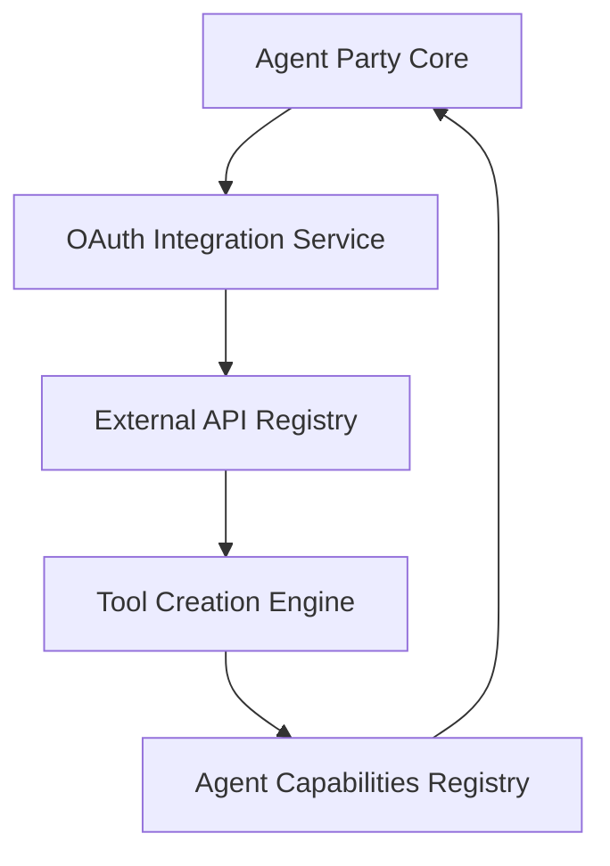

# Technical Architecture

## Technology Stack

### Core Technologies

| Component | Technology | Purpose |
|-----------|------------|---------|
| **Primary Language** | Python 3.10+ | Main implementation language |
| **Web Framework** | FastAPI | API and WebSocket endpoints |
| **Graph Database** | Neo4j | Entity storage and relationship mapping |
| **Event Stream** | Kafka | Reliable event processing |
| **Cache/State** | Redis | In-memory data and session management |
| **Object Storage** | MinIO | File and artifact management |
| **ML Framework** | PyTorch Geometric | GNN implementation |
| **Container Runtime** | Docker | Component isolation and deployment |
| **Orchestration** | Kubernetes | Scaling and service management |
| **Vector Search** | Neo4j Vector Search | Similarity-based knowledge retrieval |
| **OAuth Provider** | Auth0/Keycloak | External system authentication |

### Development Tools

| Tool | Purpose |
|------|---------|
| **Pydantic** | Data validation and schema definition |
| **Protocol Classes** | Service interface contracts |
| **pytest** | Testing framework with coverage metrics |
| **mypy** | Static type checking |
| **black & isort** | Code formatting |
| **Hypothesis** | Property-based testing |
| **Docker Compose** | Local development environment |

## Architecture Patterns

### Service Registry Pattern

All services in Agent Party are registered through a centralized Service Registry, which:
- Provides dependency injection for components
- Manages service lifecycle and initialization
- Enables mocking and testing of service dependencies
- Controls service scoping (singleton, transient, scoped)

```python
class ServiceRegistry:
    """Central registry for all system services."""
    
    def __init__(self):
        self._services = {}
        
    def register(self, service_type: Type, implementation: Any, scope: str = "singleton"):
        """Register a service implementation for a given interface type."""
        self._services[service_type] = {
            "implementation": implementation,
            "scope": scope,
            "instance": None if scope != "singleton" else implementation
        }
        
    def get_service(self, service_type: Type) -> Any:
        """Retrieve a service of the specified type."""
        if service_type not in self._services:
            raise ServiceNotFound(f"Service {service_type.__name__} not registered")
            
        service = self._services[service_type]
        
        if service["scope"] == "singleton":
            return service["instance"]
        elif service["scope"] == "transient":
            return service["implementation"]()
        # Handle other scopes as needed
```

### Repository Pattern

Data access is implemented through repositories, which:
- Abstract database operations from business logic
- Provide strongly-typed access methods
- Implement proper transaction management
- Optimize Neo4j queries with appropriate indexing

```python
class AgentRepository(Protocol):
    """Interface for agent data access."""
    
    async def get_agent_by_id(self, agent_id: str) -> Agent:
        """Retrieve an agent by ID."""
        ...
        
    async def create_agent(self, agent: Agent) -> str:
        """Create a new agent record."""
        ...
        
    async def update_agent_state(self, agent_id: str, state: str) -> None:
        """Update an agent's state."""
        ...
```

### Event-Driven Architecture

The system uses event-driven communication with:
- Strongly-typed event definitions using Pydantic
- Reliable event delivery through Kafka
- Idempotent event handlers
- Clear event ownership boundaries

```python
class AgentStateChangedEvent(BaseModel):
    """Event triggered when an agent changes state."""
    
    agent_id: str
    previous_state: str
    new_state: str
    timestamp: datetime
    transition_approver: str | None
    transition_reason: str
    metrics: dict[str, Any]
```

## Component Architecture

### Service Layer Components

```
┌───────────────────────────────────────────────────────────────┐
│                     API Layer (FastAPI)                       │
└───────────────▲───────────────────────────────▲───────────────┘
                │                               │
                │                               │
┌───────────────▼───────────┐   ┌───────────────▼───────────────┐
│  Service Layer            │   │  WebSocket Manager            │
│                           │   │                               │
│  - AgentService           │   │  - ConnectionManager          │
│  - TeamService            │   │  - MessageHandler             │
│  - TaskService            │   │  - VisualizationPublisher     │
│  - TemplateService        │   │  - EventSubscriber            │
└───────────────▲───────────┘   └───────────────────────────────┘
                │
                │
┌───────────────▼───────────────────────────────────────────────┐
│  Domain Services                                              │
│                                                               │
│  - AgentLifecycleManager                                      │
│  - TeamAssemblyService                                        │
│  - GNNRecommendationService                                   │
│  - TaskAnalysisService                                        │
└───────────────▲───────────────────────────────▲───────────────┘
                │                               │
                │                               │
┌───────────────▼───────────┐   ┌───────────────▼───────────────┐
│  Repository Layer         │   │  Infrastructure Services      │
│                           │   │                               │
│  - AgentRepository        │   │  - KafkaEventPublisher        │
│  - TeamRepository         │   │  - MinIOStorageService        │
│  - TaskRepository         │   │  - RedisStateManager          │
│  - TemplateRepository     │   │  - ModelProviderService       │
│  - WorkflowRepository     │   │  - OAuthIntegrationService    │
└───────────────▲───────────┘   └───────────────▲───────────────┘
                │                               │
                │                               │
┌───────────────▼───────────┐   ┌───────────────▼───────────────┐
│  Neo4j Database           │   │  External Services            │
└───────────────────────────┘   └───────────────────────────────┘
```

### Agent System Components

```
┌───────────────────────────┐
│  Template Registry         │
│                           │
│  - Template management    │
│  - Capability registry    │
│  - Version control        │
└───────────────▲───────────┘
                │
                │
┌───────────────▼───────────┐   ┌───────────────────────────────┐
│  Agent Factory            │   │  Talent Scout Agent           │
│                           │   │                               │
│  - Agent instantiation    │◄──┤  - Template creation          │
│  - Parameter validation   │   │  - Capability analysis        │
│  - Resource allocation    │   │  - Template optimization      │
└───────────────▲───────────┘   └───────────────────────────────┘
                │
                │
┌───────────────▼───────────┐
│  Lifecycle Manager        │
│                           │
│  - State transitions      │
│  - Approval workflows     │
│  - Event generation       │
│  - Resource tracking      │
└───────────────▲───────────┘
                │
                │
┌───────────────▼───────────┐   ┌───────────────────────────────┐
│  Agent Runtime            │   │  Manager Agents               │
│                           │   │                               │
│  - Execution environment  │◄──┤  - Transition approval        │
│  - Context management     │   │  - Policy enforcement         │
│  - Output handling        │   │  - Escalation handling        │
└───────────────────────────┘   └───────────────────────────────┘
```

### Team Formation Components

```
┌───────────────────────────┐   ┌───────────────────────────────┐
│  Task Analysis Service    │   │  Capability Registry          │
│                           │   │                               │
│  - Requirement extraction │◄──┤  - Capability definitions     │
│  - Task decomposition     │   │  - Capability compatibility   │
│  - Priority assessment    │   │  - Capability metrics         │
└───────────────▲───────────┘   └───────────────────────────────┘
                │
                │
┌───────────────▼───────────┐
│  GNN Recommendation       │
│  Engine ("DJ")            │
│                           │
│  - Path analysis          │
│  - Historical performance │
│  - Team chemistry         │
│  - Cost optimization      │
└───────────────▲───────────┘
                │
                │
┌───────────────▼───────────┐   ┌───────────────────────────────┐
│  Team Assembly Service    │   │  Performance Analytics        │
│  ("Bartender")            │   │                               │
│                           │◄──┤  - Success metrics            │
│  - Role assignment        │   │  - Collaboration insights     │
│  - Team initialization    │   │  - Model training data        │
│  - Agent coordination     │   │  - Historical benchmarks      │
└───────────────────────────┘   └───────────────────────────────┘
```

## GNN Evolutionary Orchestration

### Multi-Objective Optimization

The GNN system functions as an evolutionary orchestrator that continuously optimizes across three primary dimensions:

1. **Time Efficiency**
   - Task completion speed
   - Process latency
   - Resource utilization

2. **Cost Effectiveness**
   - API usage costs
   - Computational resources
   - Human intervention costs

3. **Quality Outcomes**
   - Task success metrics
   - Output accuracy/relevance
   - Downstream utility

### GNN Architecture

```python
class GNNOrchestrator:
    """
    Evolutionary orchestrator that recommends optimal agent collaborations.
    Functions as the "meta-agent" or "orchestrator god" that evolves the agent ecosystem.
    """
    
    def __init__(
        self,
        graph_model: GraphSAGEModel,
        experiment_tracker: ExperimentTracker,
        agent_repository: AgentRepository,
        team_repository: TeamRepository,
        task_repository: TaskRepository
    ):
        self.graph_model = graph_model
        self.experiment_tracker = experiment_tracker
        self.agent_repository = agent_repository
        self.team_repository = team_repository
        self.task_repository = task_repository
        
    async def optimize_team_composition(
        self, 
        task_id: str,
        time_weight: float = 0.33,
        cost_weight: float = 0.33,
        quality_weight: float = 0.34,
    ) -> TeamComposition:
        """
        Recommend optimal team composition for a task based on multi-objective optimization.
        
        Args:
            task_id: The task requiring a team
            time_weight: Weight assigned to time efficiency (0-1)
            cost_weight: Weight assigned to cost effectiveness (0-1)
            quality_weight: Weight assigned to quality outcomes (0-1)
            
        Returns:
            Recommended team composition
        """
        task = await self.task_repository.get_task_by_id(task_id)
        
        # Extract task requirements and constraints
        required_capabilities = task.required_capabilities
        time_constraints = task.time_constraints
        budget_constraints = task.budget_constraints
        quality_thresholds = task.quality_thresholds
        
        # Run GNN prediction to get candidate teams
        candidate_teams = await self._predict_candidate_teams(
            required_capabilities=required_capabilities,
            task_type=task.task_type,
            domain=task.domain
        )
        
        # Score candidates on multiple objectives
        scored_teams = []
        for team in candidate_teams:
            time_score = self._calculate_time_score(team, time_constraints)
            cost_score = self._calculate_cost_score(team, budget_constraints)
            quality_score = self._calculate_quality_score(team, quality_thresholds)
            
            # Weighted multi-objective score
            combined_score = (
                time_weight * time_score +
                cost_weight * cost_score +
                quality_weight * quality_score
            )
            
            scored_teams.append({
                "team": team,
                "combined_score": combined_score,
                "time_score": time_score,
                "cost_score": cost_score,
                "quality_score": quality_score
            })
        
        # Select best team and log experiment
        best_team = max(scored_teams, key=lambda x: x["combined_score"])
        await self.experiment_tracker.log_team_recommendation(
            task_id=task_id,
            recommended_team=best_team["team"],
            scores=best_team
        )
        
        return best_team["team"]
```

### Acceptance Workflow Model

Teams and agent outputs follow a cascading acceptance process with feedback loops:

```
Task Output → Automatic Validation → Human Review → Manager Approval
    ↑                  |                  |               |
    |                  v                  v               v
    +-- Rework <-- Feedback <----------- Feedback <----- Feedback
```

#### Automatic Acceptance
Measurable metrics (accuracy, completeness, etc.) stored as graph properties in Neo4j.

#### Human Interaction Layer
Rework metrics capture iteration count and type, with feedback captured as structured data points.

#### Manager Agent Oversight
Manager agents specialized by domain with approval patterns recorded for evolutionary learning.

### Neo4j Agent Representation Schema

```cypher
CREATE (a:Agent {
  id: "unique-id",
  name: "Agent Name",
  svg_uri: "https://storage.agentparty.io/agents/avatar.svg",
  system_prompt: "Detailed system prompt...",
  demographic: {
    personality: "helpful",
    expertise: ["domain1", "domain2"],
    communication_style: "concise"
  },
  performance_metrics: {
    avg_success_rate: 0.92,
    avg_time_to_completion: 120.5,
    cost_per_task: 0.032
  },
  embedding: [0.1, 0.2, ...] // Vector for similarity search
})
```

## External System Integration

### OAuth Integration Flow



1. **User Authentication Flow**
   - OAuth-based registration and login
   - Permission scoping for external systems
   - Credential management in secure storage

2. **Tool Building Process**
   - API schema discovery
   - Automatic wrapper generation
   - Tool registration in capability graph

3. **Execution Flow**
   - Agents request tool access based on capability needs
   - Permission verification before execution
   - Performance metrics gathered for optimization

### Cold Boot Process

The system initializes through a strategic cold boot process:

1. **Initial Problem Collection**
   - System owners submit representative problems
   - Problems are analyzed and decomposed into capability requirements
   - Initial agent templates are instantiated based on capability needs

2. **Bootstrap Learning**
   - Simulated runs with synthetic acceptance
   - GNN observes patterns without making modifications
   - Initial collaboration graphs are established

3. **Progressive Expansion**
   - Integration with external systems through OAuth
   - Gradual addition of new agent types
   - Evolution of agent system prompts based on performance

## Data Architecture

### Neo4j Graph Schema

Agent Party uses a graph database to model relationships between:
- Agents and their capabilities
- Team compositions and performance history
- Tasks and their requirements
- Execution timelines and event sequences

#### Primary Node Types:

```
(Agent)-[:HAS_CAPABILITY {proficiency: float}]->(Capability)
(Agent)-[:MEMBER_OF {role: string}]->(Team)
(Team)-[:ASSIGNED_TO]->(Task)
(Task)-[:REQUIRES {importance: float}]->(Capability)
(Agent)-[:CREATED]->(Output)
(Output)-[:PART_OF]->(Task)
(Agent)-[:COLLABORATED_WITH {success_rate: float, count: int}]->(Agent)
```

### Vector Search Integration

Neo4j's vector search capabilities enable:

1. **Capability Matching**: Finding the most relevant agent for a task
2. **Agent Similarity**: Identifying potential collaboration patterns
3. **Knowledge Retrieval**: Accessing relevant past experiences

Sample vector search query:

```cypher
// Find agents with similar capabilities to a reference agent
MATCH (reference:Agent {id: $reference_id})
CALL db.index.vector.queryNodes('agent_embedding_index', 10, reference.embedding)
YIELD node AS similar_agent, score
WHERE similar_agent <> reference
RETURN similar_agent.id, similar_agent.name, score
ORDER BY score DESC
LIMIT 5
```

### Event Schema

The system uses a structured event schema for:
- Agent lifecycle events
- Team formation events
- Task execution events
- System state changes

All events follow a consistent pattern:
- Strong typing with Pydantic
- Required metadata (timestamps, correlation IDs)
- Event-specific payload
- Idempotency keys where appropriate

## Integration Architecture

### External Systems Integration

Agent Party supports integration with external systems through:
- REST APIs with OpenAPI documentation
- Event streams for asynchronous communication
- WebSocket interfaces for real-time updates

### Model Provider Integration

The system abstracts model providers (like OpenAI, Anthropic, etc.) through:
- Provider-specific adapters
- Common interface contracts
- Response normalization
- Cost accounting

## Deployment Architecture

### Container Strategy

Components are containerized following these principles:
- Clear service boundaries
- Proper health checks
- Resource constraints
- Configuration through environment

### Kubernetes Deployment

The system deploys to Kubernetes with:
- Stateful components using StatefulSets
- Stateless components using Deployments
- Service mesh for communication
- Proper secret management

## Security Architecture

### Authentication and Authorization

The system implements:
- OAuth for user authentication
- RBAC for authorization
- JWT for token management
- Secure context propagation

### Data Protection

Data protection includes:
- Encryption at rest and in transit
- PII protection
- Data minimization
- Access auditing

## Observability Architecture

### Monitoring

The system provides:
- Component health metrics
- Performance tracking
- Resource utilization
- Business metrics

### Logging

Logging standards include:
- Structured logs in JSON
- Consistent correlation IDs
- Appropriate verbosity levels
- Contextual information

### Tracing

Distributed tracing covers:
- Cross-service interactions
- Performance bottlenecks
- Error propagation
- Request flows

## Reliability Engineering

### Error Handling

The system implements:
- Graceful degradation
- Circuit breakers
- Retry strategies
- Fallback mechanisms

### Load Management

Load handling strategies include:
- Rate limiting
- Throttling
- Backpressure
- Graceful overload handling
